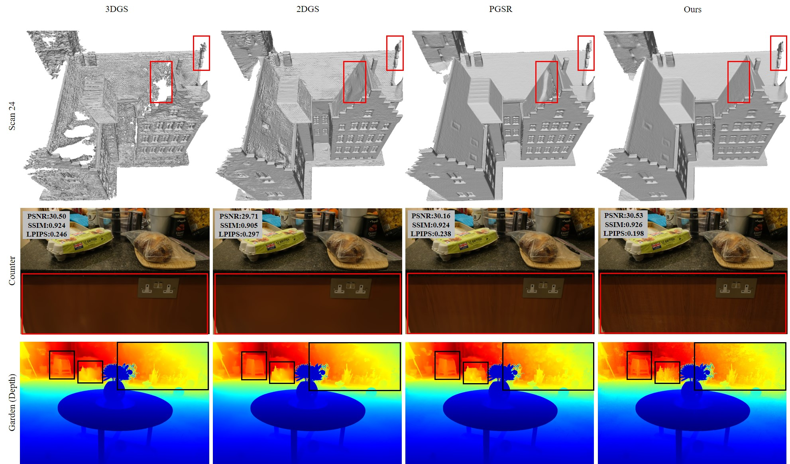

# CGC-GS
Code for "CGC-GS: Cross Geometric Cues Constrained Gaussian Splatting". Once the code is organized, more details will be posted.
# Results
 
 Chamfer distance (↓) results on DTU dataset:
|                | 24   | 37   | 40   | 55   | 63   | 65   | 69   | 83   | 97   | 105  | 106  | 110  | 114  | 118  | 122  | Mean |
|----------------|------|------|------|------|------|------|------|------|------|------|------|------|------|------|------|------|
| **2DGS**       | 0.51 | 0.96 | 0.38 | 0.43 | 1.02 | 0.89 | 0.80 | 1.37 | 1.24 | 0.70 | 0.68 | 1.50 | 0.41 | 0.72 | 0.52 | 0.81 |
| **PGSR**       | 0.34 | 0.58 | 0.29 | 0.29 | 0.78 | 0.58 | 0.54 | 1.01 | 0.73 | 0.51 | 0.49 | 0.69 | 0.31 | 0.37 | 0.38 | 0.53 |
| **CGC-GS**     | 0.36 | 0.65 | 0.37 | 0.32 | 0.76 | 0.52 | 0.49 | 1.11 | 0.68 | 0.61 | 0.38 | 0.51 | 0.33 | 0.40 | 0.38 | 0.52 |
